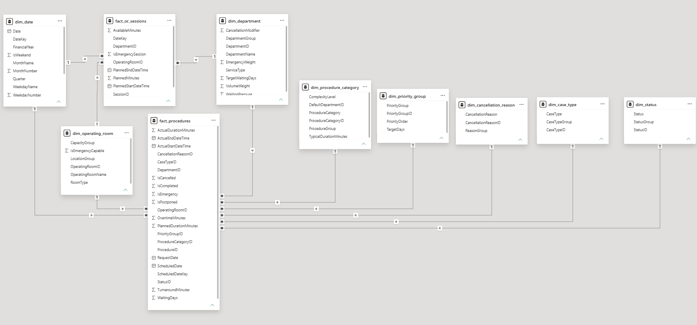
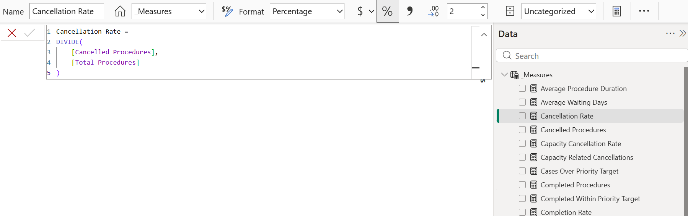

# Performance Overview Dashboard

A Power BI portfolio project demonstrating healthcare operations reporting, data modelling, DAX measure development, operational KPI design, and executive dashboard development.

## Project Background

This project is based on a healthcare operations analytics and optimisation project for a New South Wales hospital, conducted in collaboration with the University of Melbourne.

The dataset covered procedure-level surgical operations records from 2022 to 2024, including approximately 36,000 surgical cases across completed, cancelled, and postponed procedures.

The business need was to give surgical operations stakeholders a clearer dashboard view of key metrics, including procedure activity, elective and emergency demand, waiting times, cancellations, department performance, and operating room utilisation.

Before any reporting or optimisation work could be performed, the data required substantial cleaning, transformation, and restructuring using Power Query. This included preparing date and time fields, standardising procedure status categories, deriving waiting time and duration measures, mapping departments and operating rooms, classifying elective and emergency activity, preparing cancellation reason groups, and converting the operational records into a structured model suitable for Power BI reporting.

The dashboard was developed to provide stakeholders with an executive view of surgical operations performance and to support further analysis for service planning, resource allocation, and optimisation.

## Project Summary

This project presents an end-to-end business intelligence solution for monitoring surgical operations performance. It demonstrates how detailed healthcare operations data can be transformed into a structured reporting model and an executive-level Power BI dashboard.

The dashboard helps stakeholders understand:

- overall surgical activity volume
- completed, cancelled, and postponed procedures
- elective versus emergency demand
- waiting time patterns
- department-level performance
- operating room utilisation
- cancellation trends
- areas requiring further planning or optimisation attention

## Business Context

Healthcare operations teams often need to monitor activity across multiple service areas, including elective and emergency procedures, waiting lists, cancellations, operating room capacity, department performance, and overtime.

A key challenge is converting detailed operational records into clear, decision-ready insights. In this project, the dashboard was designed as a reporting layer that brings key operational metrics into one view and supports evidence-based discussion around surgical performance and service pressure.

The reporting work also supported the broader optimisation objective: understanding where demand, capacity, cancellations, and waiting times created pressure in the surgical system before applying more advanced optimisation and decision-support methods.

## Project Workflow

The project followed a practical BI workflow:

1. Understanding the healthcare operations problem and stakeholder reporting needs.
2. Reviewing surgical activity, operating room, waiting time, cancellation, and emergency demand data.
3. Cleaning and transforming raw operational records into analysis-ready tables.
4. Designing a structured data model using fact and dimension tables.
5. Creating DAX measures for surgical performance KPIs.
6. Building an executive Power BI dashboard for stakeholder reporting.
7. Using the reporting insights to support further optimisation and decision-support work.

## Dashboard Preview


## Key Questions Answered

This dashboard helps answer questions such as:

- How many procedures were scheduled and completed?
- What proportion of procedures were elective versus emergency?
- Which departments have the highest procedure volume?
- How are waiting times changing over time?
- Which departments have higher cancellation rates?
- How effectively is operating room capacity being used?
- Where may operational pressure or service bottlenecks exist?
- Which areas may require further optimisation or planning attention?

## Dashboard Features

- Executive KPI cards for high-level performance monitoring
- Monthly procedure trend analysis
- Elective versus emergency case mix
- Department-level performance comparison
- Cancellation and waiting time indicators
- Operating room utilisation reporting
- Interactive slicers for year, department, case type, and procedure status
- Star-schema data model designed for scalable Power BI reporting
- DAX measures for operational KPIs and performance metrics
- Documentation of business requirements, data model, data dictionary, and DAX logic

## Data Preparation and Transformation

The project required several data preparation steps before dashboard development, including:

- cleaning procedure-level activity records
- standardising date and time fields
- preparing scheduled, completed, cancelled, and postponed procedure indicators
- deriving waiting time and duration measures
- structuring elective and emergency case classifications
- mapping departments, operating rooms, procedure categories, cancellation reasons, and priority groups
- preparing fact and dimension tables for Power BI modelling
- validating KPI definitions for reporting consistency

These steps were important because healthcare operations data is often detailed and process-driven. A clear data model was needed before meaningful dashboard reporting and optimisation analysis could be performed.

## Data Model

The Power BI model is designed using a star-schema structure with fact and dimension tables.

Main fact tables:

- `fact_procedures`
- `fact_or_sessions`

Dimension tables:

- `dim_date`
- `dim_department`
- `dim_procedure_category`
- `dim_operating_room`
- `dim_case_type`
- `dim_status`
- `dim_cancellation_reason`
- `dim_priority_group`



More details are available in:

- [Data Model & Dataset Design](documentation/02_data_model_and_dataset_design.md)
- [Data Dictionary](documentation/data_dictionary.md)

## DAX Measures

The report includes DAX measures for:

- total procedures
- completed procedures
- cancelled procedures
- cancellation rate
- emergency rate
- average waiting days
- operating room utilisation
- overtime hours
- capacity-related cancellations

Example measure:

```DAX
Cancellation Rate =
DIVIDE(
    [Cancelled Procedures],
    [Total Procedures]
)
```

Full measure documentation is available here:

- [DAX Measures](documentation/dax_measures.md)



## Repository Structure

```text
performance-overview-dashboard/
├── README.md
├── data/
│   ├── fact_procedures.csv
│   ├── fact_or_sessions.csv
│   ├── dim_date.csv
│   ├── dim_department.csv
│   ├── dim_procedure_category.csv
│   ├── dim_operating_room.csv
│   ├── dim_case_type.csv
│   ├── dim_status.csv
│   ├── dim_cancellation_reason.csv
│   └── dim_priority_group.csv
├── documentation/
│   ├── 01_business_requirements.md
│   ├── 02_data_model_and_dataset_design.md
│   ├── data_dictionary.md
│   └── dax_measures.md
├── images/
│   ├── executive_overview.png
│   ├── data_model.png
│   └── dax_measures.png
└── powerbi/
    └── performance_overview_dashboard.pbix
```

## Tools and Skills Demonstrated

- Power BI dashboard development
- Healthcare operations reporting
- Data modelling and star-schema design
- DAX measure development
- KPI design
- Data cleaning and transformation
- Executive dashboard design
- Data storytelling
- Performance monitoring
- Operational analytics
- Optimisation-oriented reporting
- GitHub project documentation

## Project Files

- [Business Requirements](documentation/01_business_requirements.md)
- [Data Model & Dataset Design](documentation/02_data_model_and_dataset_design.md)
- [Data Dictionary](documentation/data_dictionary.md)
- [DAX Measures](documentation/dax_measures.md)

## Data Note

This public portfolio repository uses a structured demonstration dataset designed to reflect the format, scale, and operational patterns of healthcare surgical activity data. No confidential, proprietary, patient-level, or identifiable organisational information is included.

## Author

**Hajar Sadegh Zadeh**  
Business Intelligence | Healthcare Analytics | Data Modelling | Power BI | Optimisation
