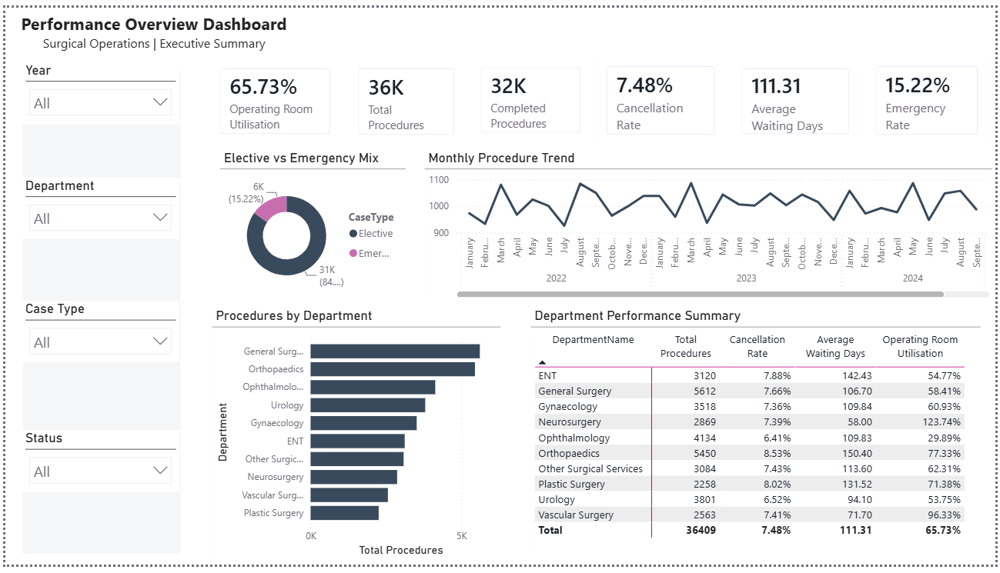

# Performance Overview Dashboard

A Power BI portfolio project demonstrating operational performance reporting using a synthetic surgical operations dataset.

## Project Overview

This project is inspired by real hospital operations reporting challenges encountered during professional experience with surgical operations data in New South Wales, Australia.

The dashboard helps stakeholders monitor procedure activity, elective versus emergency demand, waiting times, cancellations, operating room utilisation, and department-level performance.

All data used in this project is synthetic and generated for public portfolio demonstration only.

## Dashboard Preview

Add your screenshot here after uploading it to the `images` folder:

```markdown

```

## Repository Structure

```text
performance-overview-dashboard/
├── README.md
├── data/
├── documentation/
├── images/
└── powerbi/
```

## Tools Used

- Power BI Desktop
- Power Query
- DAX
- CSV / Excel
- GitHub
- Markdown

## Confidentiality Statement

This project is inspired by real operational reporting challenges encountered during professional experience. All datasets are synthetic and generated to reflect realistic operational patterns. No confidential, proprietary, or identifiable information from any organisation has been used.
